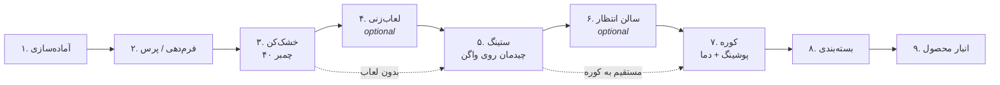

# Production Flow — Roof-Tile / Clay Roof Tile Line

> **Status:** Owner-confirmed (2026-08-31). This is the **canonical physical sequence** for the
> reference plant. All other docs, ADRs, SRS items, and UI ordering must align with this file.
> Decision record: [ADR-0009](../adr/ADR-0009-production-workflow-sequence.md).

---

## 1. End-to-end sequence (nine stages)

| # | Stage (EN) | Stage (FA) | Optional? | Operational records in project |
|---|------------|------------|-----------|--------------------------------|
| 1 | Preparation | آماده‌سازی | No | ❌ Not in Excel / not in MVP |
| 2 | Forming / Press | فرم‌دهی / پرس | No | ❌ Not in Excel / not in MVP |
| 3 | Dryer | خشک‌کن (۴۰ چمبر) | No | ✅ `Dryer-All.xlsx` · app **F1** |
| 4 | Glazing | لعاب‌زنی | **Yes** — product-dependent | ⚠️ Glaze as dimension only; no glazing-station module yet |
| 5 | Setting | ستینگ (چیدمان روی واگن) | No | ✅ `Set_All_1.xlsx` · app **F2** |
| 6 | Waiting hall | سالن انتظار | **Yes** — wagons may wait before kiln | ⚠️ State in `wagon_trip` (`waiting_hall`); no temp-log module yet |
| 7 | Kiln | کوره (پوشینگ + دما) | No | ✅ `Kiln-Merged.xlsx` · app **F3/F4** |
| 8 | Packing | بسته‌بندی (درجه‌بندی + ضایعات) | No | ✅ `Packing-All.xlsx` · app **F5** |
| 9 | Finished-goods warehouse | انبار محصول | No | ❌ Legacy schema only; not in MVP |

---

## 2. Flow diagram



**Binding rules:**

1. **Dryer always precedes Setting.** Setting loads the *dried* body from a dryer chamber onto wagons; it does not precede drying.
2. **Glazing** applies only to glazed product lines; self-colored (خودرنگ) products skip stage 4.
3. **Waiting hall** is optional buffer time between Setting and Kiln; the app models it as `waiting_hall` trip status.
4. **Kiln** is a FIFO tunnel (capacity **44**); entry at push_seq *P* → exit at *P+43* (see M5_SRS §3.1).
5. Stages **1–2** and **9** are real on the floor but have **no historical Excel module** in this repository yet.

---

## 3. What the MES app records today (M5 slice)

Physical order vs **system recording scope**:

```
[1 Prep] [2 Press]     — out of scope (future)
        ↓
[3 Dryer F1]           — first recorded step; produces dried body in chamber 1..40
        ↓
[4 Glaze]              — optional; glaze captured on Setting wagon row when applicable
        ↓
[5 Setting F2]         — chamber-centric batch: unload chamber → load 1..4 wagons
        ↓
[6 Waiting hall]       — implicit state between F2 and F3 (no dedicated form yet)
        ↓
[7 Kiln F3/F4]         — push + 18 sensors; exit auto-derived (FIFO-44)
        ↓
[8 Packing F5]         — grading; closes wagon_trip
        ↓
[9 Warehouse]            — out of scope (future)
```

**Trip spine (`wagon_trip`):** currently starts at **Setting load** (F2). Full traceability requires linking each trip back to the **dryer cycle** (F1) that produced its body — tracked via `ChamberState` and chamber FK on `setting_event`.

---

## 4. Excel / staging module map

| Stage | Consolidated source | Staging / app tables |
|-------|---------------------|----------------------|
| 3 Dryer | `Dryer-All.xlsx` | `dryer_cycle`, `dryer_reading` |
| 5 Setting | `Set_All_1.xlsx` | `setting_event`, `setting_wagon` |
| 7 Kiln | `Kiln-Merged.xlsx` | `kiln_push`, `kiln_wagon`, `kiln_reading`, `kiln_sensor`, `kiln_exit` |
| 8 Packing | `Packing-All.xlsx` | `packing_header`, `packing_wagon` |
| Cross-stage | — | `wagon`, `wagon_trip`, `etl_trip_map` |

See [DATA_SOURCES.md](DATA_SOURCES.md) for authoritative file paths.

---

## 5. Corrections superseded by this document

| Incorrect statement | Correct |
|--------------------|---------|
| Setting → Dryer → Kiln | **Dryer → Setting → (Waiting hall) → Kiln → Packing** |
| Forming before Dryer in recorded data | Forming is **stage 2** physically; **Dryer is the first recorded MES step** |
| Setting loads wet clay | Setting loads **dried body** discharged from a dryer chamber |

---

*Generated 2026-08-31. Update only via owner confirmation + new ADR if the sequence changes.*
